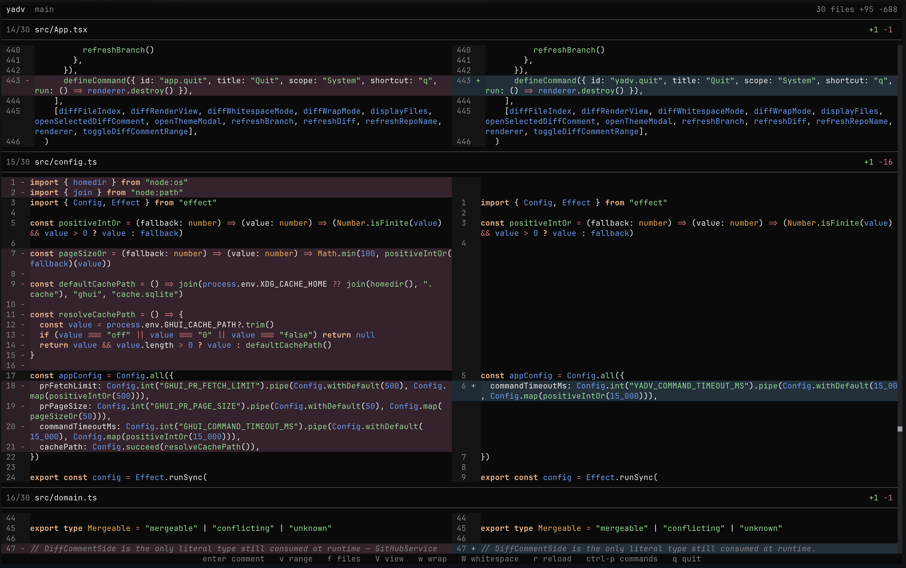

# yadv

Yet Another Local Diff Viewer for git working trees. There are many local diff viwers, but this one is mine.

fork of [ghui](https://github.com/kitlangton/ghui) to make it work for local diff changes because its ui is beautiful

## Keybindings

- `up` / `down`: move selection
- `k` / `j`: move selection
- `gg` / `G`: jump to first or last diff anchor
- `ctrl-u` / `ctrl-d`: page up or down
- `ctrl-p` / `cmd-k`: open the command palette
- `esc`: close the active modal
- `r`: refresh
- `up` / `down` / `pageup` / `pagedown`: move through the diff
- `enter`: open the selected diff comment thread
- `v`: start or clear a multi-line comment range
- `n` / `p`: jump between comment threads
- `f`: open the changed-files navigator while viewing a diff
- `left` / `right`: choose the deleted or added side while in split diff comment mode
- `[` / `]`: switch files while viewing or commenting on a diff
- `t`: choose a fixed theme, including `System` to match your terminal colors; press `m` in the theme picker to follow the OS light/dark appearance with separate theme choices
- `q`: quit

## Credits

- Forked from [ghui](https://github.com/kitlangton/ghui) by Kit Langton.
